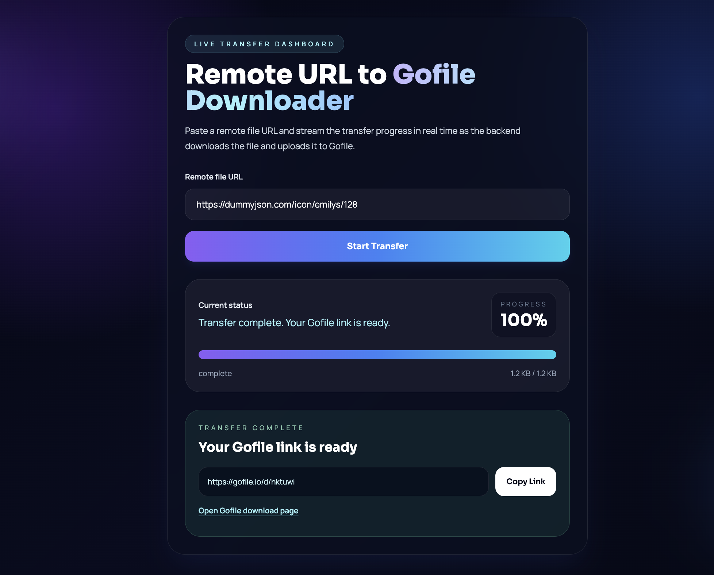

# ☁️ CloudTransfer: Remote URL to Gofile

A sleek, modern web application that acts as a high-speed middleman for your files. CloudTransfer fetches files from any remote URL and seamlessly uploads them directly to [Gofile.io](https://gofile.io) servers, completely bypassing your local network bandwidth.

Built with a premium, glassmorphism UI and powered by a robust Node.js backend.

## Preview

Live app: https://huggingface.co/spaces/rafin101/downloader-backend

## ✨ Features

* **Cloud-to-Cloud Transfer:** Download huge files to the server and push them to Gofile without eating up your personal internet data.
* **Real-Time Progress:** Utilizes Server-Sent Events (SSE) to stream live, highly accurate download and upload percentages directly to the UI.
* **Premium UI/UX:** A beautiful, responsive dashboard built with Tailwind CSS, featuring dark mode, glassmorphism, and smooth animations.
* **Docker-Ready:** Completely containerized and ready to deploy on any platform supporting Docker (like Hugging Face Spaces or Oracle Cloud).

## 🛠️ Tech Stack

**Frontend:**
* HTML5 / Vanilla JavaScript
* Tailwind CSS (via CDN)
* Server-Sent Events (SSE) Client

**Backend:**
* Node.js & Express.js
* Axios (for stream handling)
* Form-Data (for Gofile API integration)
